Hello world - to kick the main branch. I don't know why it's not updating.

Hello

## Flowchart

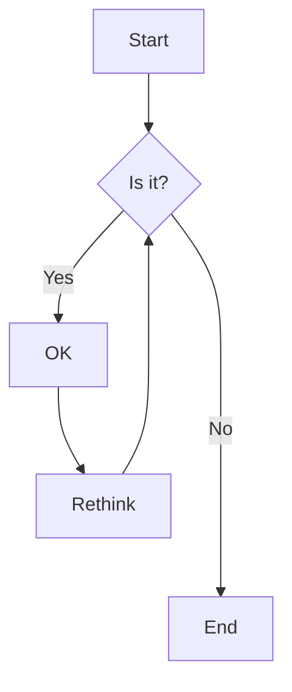

## Flowchart LR

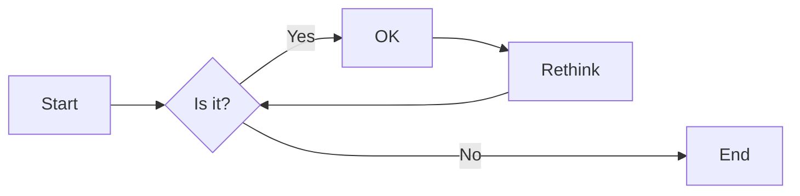

## GitGraph

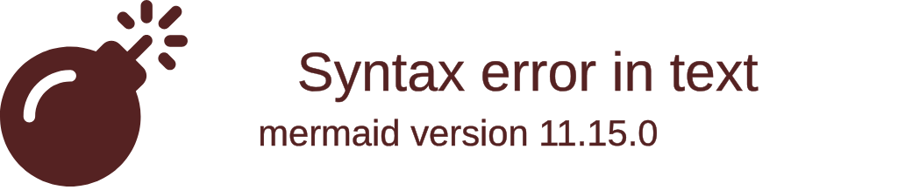

## Quadrant chart

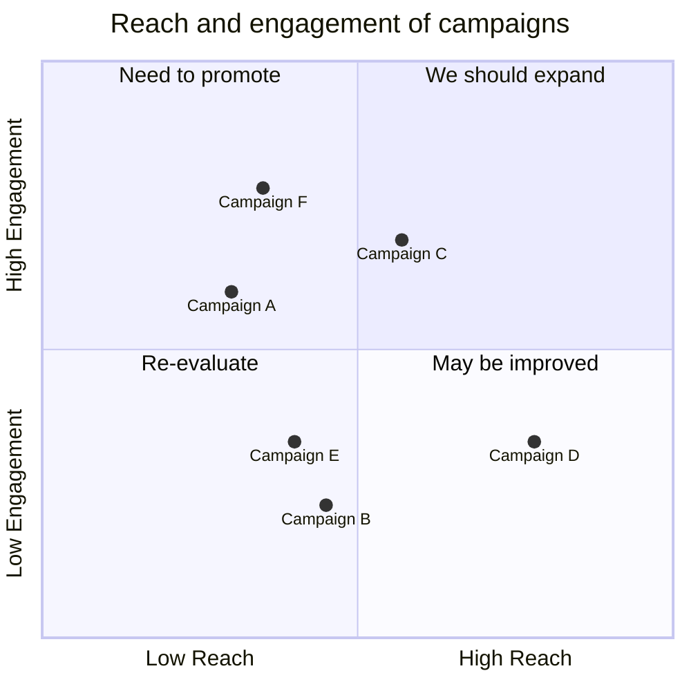

## Pie chart

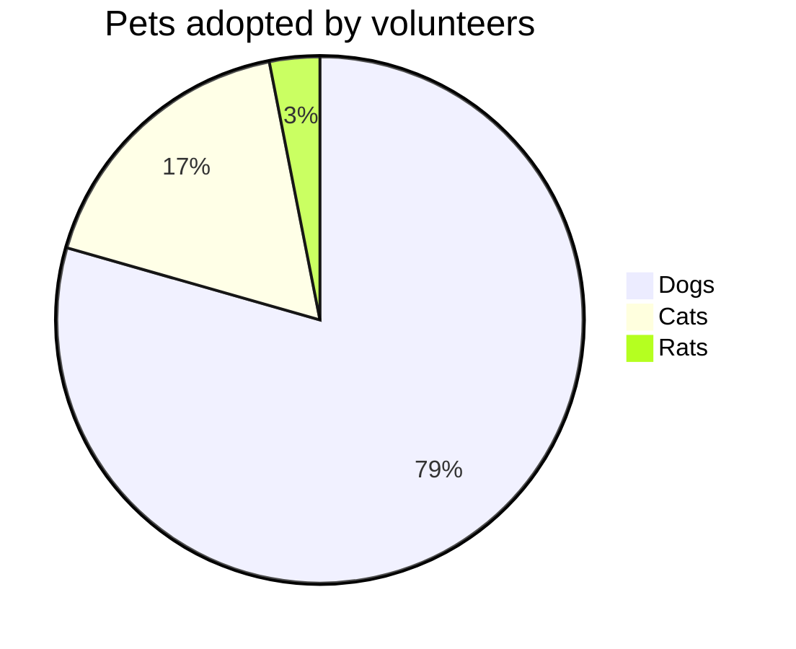

## User Journey

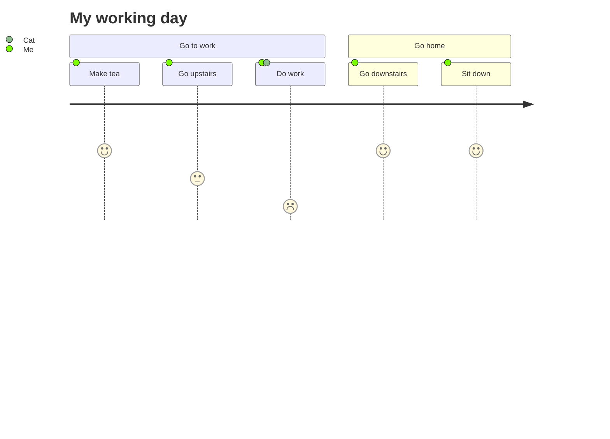

## Entity Relationship Diagram

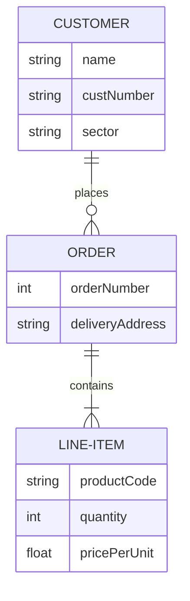

## State Diagram

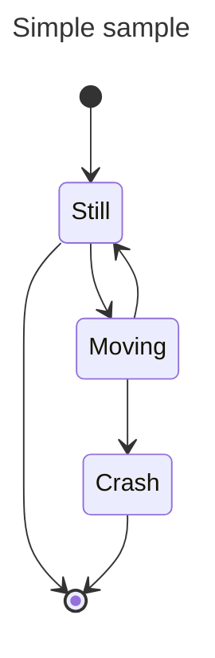

## Class Diagram

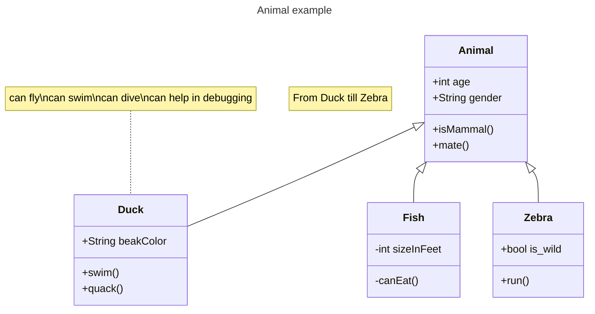

## Sequence Diagram

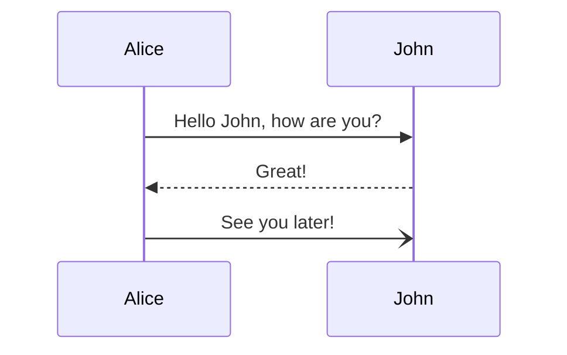

## Mindmap

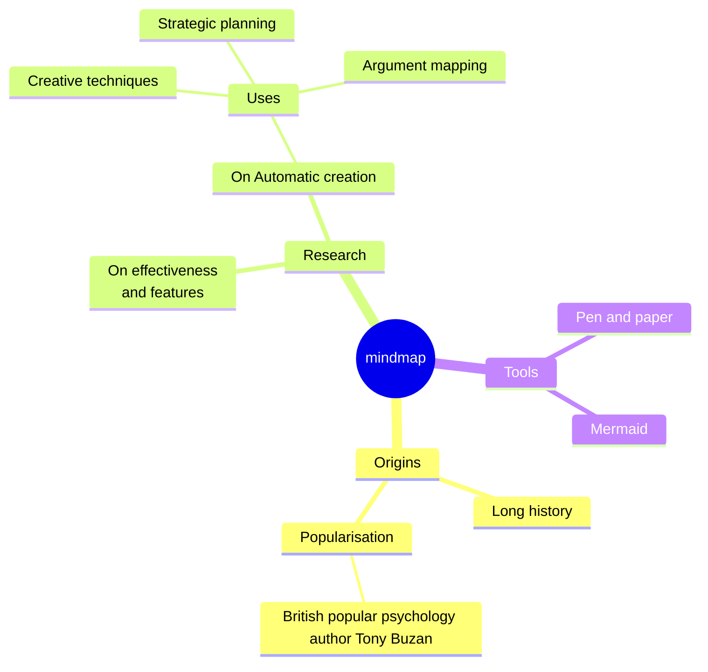

## Timelines

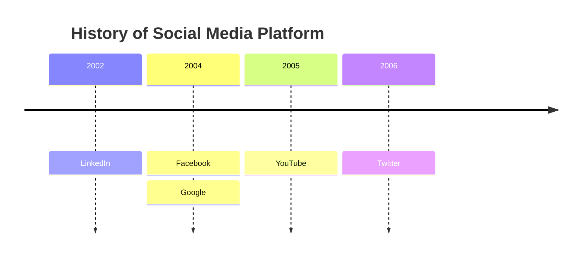
